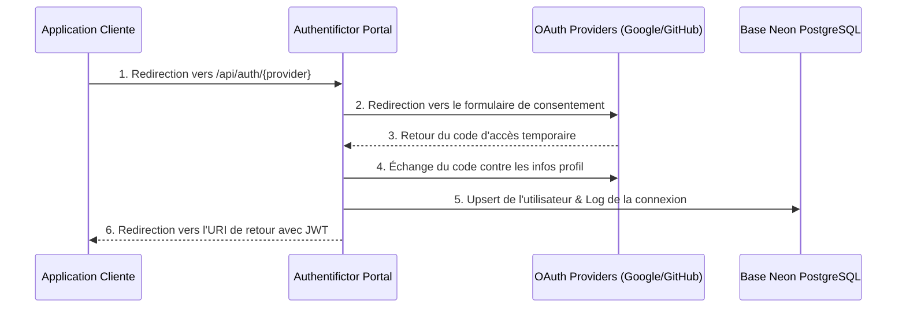

# Guide d'Utilisation et d'Intégration d'Authentifictor

Ce guide complet vous explique comment utiliser la Console d'Administration d'**Authentifictor** et comment intégrer notre service d'authentification centralisé (Identity Provider OAuth2) dans vos propres applications clientes.

---

## 1. Vue d'Ensemble du Service

Authentifictor centralise la connexion utilisateur (via Google et GitHub) pour toutes vos applications.



---

## 2. Console d'Administration (Panel Admin)

Accessible à l'adresse `/admin`, le nouveau Panel Admin (thème **Logistix**) permet de superviser l'ensemble du service en temps réel sans données fictives.

### Fonctionnalités Clés :
*   **Indicateurs de Performance en Direct (8 Capsules) :** Suivi en temps réel des utilisateurs inscrits, connexions totales, succès/échecs Google, succès/échecs GitHub, et statuts globaux.
*   **Journal d'Audit des Connexions :** Table listant les ID de transactions d'authentification, les applications d'origine, les fournisseurs, le statut de connexion ("Succès" ou "Échec"), les localisations géographiques et les informations d'utilisateurs.
*   **Répertoire complet des Utilisateurs :** Liste complète de tous les comptes créés avec leurs avatars et dates d'inscription.
*   **Générateur de Liens OAuth2 (Onglet "Générateur de Tests") :** Outil interactif pour entrer le nom de votre application et votre URL de callback, générer instantanément l'URL d'authentification correcte, et la tester directement.
*   **Console de Diagnostic API (Onglet "Diagnostic Console") :** Terminal interactif pour exécuter des tests d'intégration directement dans le navigateur et inspecter les réponses JSON :
    - `Test Stats API` : Interroge `/api/admin/stats`.
    - `Test Google Auth API` / `Test GitHub Auth API` : Vérifie la réponse et la redirection OAuth.
    - `Database Diagnostics` : Teste la communication avec PostgreSQL Neon.
*   **Réinitialisation de la base de données :** Le bouton rouge **"Vider la Base Neon"** (en haut à droite) permet de supprimer instantanément toutes les lignes de la base de données pour repartir à zéro en phase de test.

---

## 3. Guide d'Intégration pour vos Applications

### Étape A : Initier la Redirection
Redirigez l'utilisateur vers les URLs d'Authentifictor en passant les paramètres nécessaires.

```javascript
// Exemple de redirection en React/JS
const handleOAuthLogin = (provider) => {
  const serviceUrl = window.location.origin; // Remplacez par votre URL de production
  const appName = "MonSuperProjet";
  const redirectUri = window.location.origin + "/auth-callback";
  
  // URL finale : /api/auth/google?app=MonSuperProjet&redirect_uri=http://localhost:5173/auth-callback
  window.location.href = `${serviceUrl}/api/auth/${provider}?app=${appName}&redirect_uri=${redirectUri}`;
};
```

**Paramètres Query requis :**
- `app` : Nom de votre application cliente (affiché dans le panel admin).
- `redirect_uri` : URI de retour de votre application, autorisée à recevoir le token JWT.
- `email` *(optionnel, Google uniquement)* : Adresse e-mail pour préremplir l'écran de connexion.

---

### Étape B : Récupérer le Token JWT sur votre page de Callback
Une fois connecté, Authentifictor redirige l'utilisateur vers votre `redirect_uri` avec les paramètres query :
`https://votre-app.com/auth-callback?status=success&app=MonSuperProjet&token=eyJhbGciOiJIUzI1...`

Exemple de traitement de la redirection en React :

```javascript
import { useEffect } from 'react';
import { useSearchParams, useNavigate } from 'react-router-dom';

const AuthCallback = () => {
  const [searchParams] = useSearchParams();
  const navigate = useNavigate();

  useEffect(() => {
    const status = searchParams.get('status');
    const token = searchParams.get('token');
    const app = searchParams.get('app');

    if (status === 'success' && token) {
      // 1. Stocker le token localement
      localStorage.setItem('auth_token', token);
      console.log(`Connecté avec succès à l'application ${app}`);
      
      // 2. Rediriger l'utilisateur vers l'espace membre
      navigate('/dashboard');
    } else {
      console.error("L'authentification a échoué.");
      navigate('/login-failed');
    }
  }, [searchParams, navigate]);

  return (
    <div className="flex flex-col items-center justify-center min-h-screen bg-slate-900 text-slate-100">
      <div className="w-10 h-10 border-4 border-blue-500/20 border-t-blue-500 rounded-full animate-spin mb-4"></div>
      <p className="font-medium text-sm">Vérification de la session en cours...</p>
    </div>
  );
};

export default AuthCallback;
```

---

### Étape C : Utiliser et Vérifier le Token JWT
Le jeton JWT renvoyé contient les informations suivantes décodables en base64 :
```json
{
  "id": "usr_abc123",
  "email": "user@example.com",
  "name": "Jean Dupont",
  "app": "MonSuperProjet",
  "iat": 1718294400,
  "exp": 1718298000
}
```

*   **Côté Client :** Décodez simplement le payload pour afficher le nom ou l'avatar de l'utilisateur.
*   **Côté Serveur (Backend) :** Pour chaque requête sécurisée, votre backend doit valider la signature du jeton en utilisant la variable d'environnement `JWT_SECRET` partagée pour confirmer que le jeton est intègre et provient d'Authentifictor.
